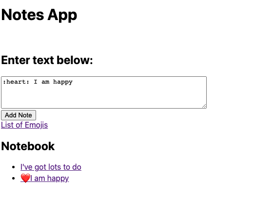

 
# Notes App
--------------
A week-long group project to create a single-page web app in vanilla JS - including the creation of our own testing library.

## App functionality: 
### How to use 
1. `git clone` this repo
2. `cd` into the directory 
3. Run `open index.html` to use the app
4. You can see the tests passing in the JS console

### Features list
[ x ] A user can enter a note into a text box and see the first 20 characters of the note saved
[ x ] If they type something like :fire: the note will make a call to an external API and convert it to an emoji 🔥
[ x ] The user can click on the note to see the full note displayed

### Screenshot 


### Goals / Learning objectives
* Build a frontend single-page app using only pure Javascript.
* Request and use data from an external API.
* Write a testing framework in Javascript.

### Planning

### User stories
  ```
As a programmer
So I can find the one I want
I can see a list of my notes, where each note is abbreviated to the first 20 characters


As a programmer
So I can record something I need to remember
I can create a new note


As a programmer
So I can see all the information in the note
I can see the full text of an individual note on its own page


As a programmer
So I can record notes with fun little pictures
I can use shortcodes like `:fire:` that get converted into emojis like 🔥
```

### Sequence diagram modelling how the interface might work

	
------------
## Tests

Our test helpers are stored in the folder `testLibrary.js` and our tests can be seen passing in the JS console when you open the app

------------
## Designed by:
* Finn Williamson 	| [GitHub](https://github.com/fwill22) <br>
* Kerri McMahon 	| [GitHub](https://github.com/kerrimcm)<br>
* Cynthia Anyaeriuba	| [GitHub](https://github.com/C-A-Tech) <br>
